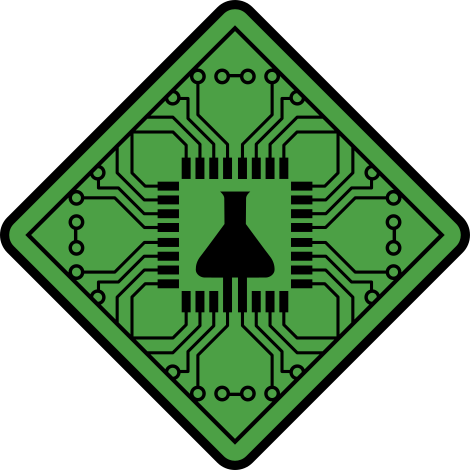

# LongevityBench Design System

Design system for **LongevityBench**, the LLM benchmarking dashboard built by **SD hackers** at the Caltech Longevity Hackathon (Track 01 · LongevityLLM benchmarking, sponsored by [Insilico Medicine](https://insilico.com)).

The product evaluates Insilico's longevity-tuned L-LLM (a fine-tuned Qwen3.5-9B) against general-purpose models like GPT-4o. The dashboard leads with **trust in AI reasoning** — trace-faithfulness scoring against live scientific databases — followed by **model comparison** and **live monitoring**.

Visual theme is modelled on Insilico Medicine's clean, white-first scientific aesthetic: green-on-near-white, restrained shadows, monospace data, lots of whitespace.

---

## What we are designing for

The product is a **benchmarking dashboard** that runs L-LLM (and GPT-4o as a baseline) against the [LongeBench dataset](https://dx.doi.org/10.57967/hf/8851) and adjacent task suites built on SynergyAge (gene-combination epistasis) and MGI (mouse allele → lifespan phenotype). The interface needs to surface:

- **Run state** — which tasks are currently evaluating, latency, errors
- **Scores** — macro F1, balanced accuracy, MAE, bootstrap CIs, baseline deltas
- **Prompts + responses** — the ChatML record, the model's `<think>` trace, the gold answer, the parsed answer
- **Gap analysis** — where L-LLM beats GPT-4o and where it fails, broken down by task and question format
- **Trace faithfulness** — automated bio-fact-checker output for L-LLM reasoning traces

This is a research instrument, not a consumer product. Visual hierarchy must serve **scanning hundreds of records quickly** — dense tables, sortable columns, monospace IDs, clear yes/no states.

## Sources used

| Source | URL |
|---|---|
| Benchmarking codebase | https://github.com/parthtr9/L-LLMBenchmarking |
| Insilico Medicine homepage (visual reference) | https://insilico.com |
| Insilico Design Resources (logos) | https://insilico.com/design-resources |
| Pharma.ai product suite (sibling brand) | https://pharma.ai |
| LongeBench dataset | https://dx.doi.org/10.57967/hf/8851 |
| Scicons (open-source science icon pack) | https://github.com/Science-icons/Scicons |

Readers with access can explore the GitHub repo further to refine designs against the actual runner code and prompt format. The Insilico design kit (downloadable PPT + SVG icon pack) is the canonical source for further iconography — it is CC BY-NC-SA 4.0 and worth pulling in if you need more than what is bundled here.

---

## Index — what's in this folder

```
README.md                  ← you are here
INTEGRATION.md             ← how to wire into the L-LLMBenchmarking repo with Inspect AI
SKILL.md                   ← Agent Skill manifest (Claude Code compatible)
colors_and_type.css        ← CSS variables: colors, typography, spacing, radii, shadows
tools/
  export_inspect_logs.py   ← Inspect AI .eval → dashboard data.json bridge
assets/                    ← logos, badges (Insilico), science icons (Scicons)
fonts/                     ← (Google-hosted; see Type)
preview/                   ← cards rendered in the Design System tab
ui_kits/
  longevity_bench/         ← the dashboard UI kit
    README.md
    index.html             ← interactive click-thru of the full app
    *.jsx                  ← React components
```

---

## Brand snapshot

**Team:** SD hackers
**Product name:** LongevityBench (internal: LB)
**Tagline:** *Benchmarking AI for the biology of aging.*
**Sponsor:** Insilico Medicine (source of L-LLM)
**Voice:** scientific, terse, evidence-first. No hype, no emoji, no marketing intensifiers.

---

## CONTENT FUNDAMENTALS

**Tone is sober and technical.** The audience is researchers reading a paper or running an eval — not consumers. Copy should sound like the methods section of a journal article: precise, falsifiable, never embellished.

**Voice rules:**
- Third person or imperative. Avoid "we" in product UI; reserve it for the README and About copy.
- Address the user with "you" sparingly, only in CTAs and tooltips ("you can re-run this task").
- No hedging ("might", "perhaps"), no marketing intensifiers ("powerful", "cutting-edge", "blazingly fast"), no exclamation marks.
- State results numerically. "Macro F1 0.62 (95% CI 0.58–0.66)" not "good performance".

**Casing:**
- **Sentence case** for UI labels, buttons, table headers ("Run benchmark", not "Run Benchmark").
- **TitleCase** only for product / brand names: LongevityBench, L-LLM, Pharma.ai, PandaOmics.
- **UPPERCASE** reserved for eyebrows and tracking labels (`TASK A • EPISTASIS`).
- **lowercase-hyphenated** for C. elegans gene symbols: `daf-2`, `age-1`. Never capitalize them.
- **All-caps human/mouse gene symbols** as standard: `FOXO3`, `MTOR`, `Trp53`.

**Emoji: never.** Insilico does not use emoji. We don't either.

**Numbers + units:**
- Always tabular-nums (use `.lb-tnum`). Right-align numeric columns.
- Two decimal places for F1 / accuracy / MAE; three only when CIs would collapse otherwise.
- Percent change as signed decimal: `−23.5%` (use the proper minus, not a hyphen).
- Show CIs inline in parentheses: `0.62 (0.58–0.66)`.
- Time: `4.2s`, not `4.2 seconds`. Tokens: `1,284 tok`.

**Copy examples (good):**

> *Macro F1 on Task A (epistasis ternary): L-LLM 0.61 vs GPT-4o 0.58. Majority-class baseline 0.42.*

> *20 rows queued. 4 in flight. Avg latency 6.3s.*

> *Trace inconsistent with final label: trace says "extends lifespan", label is "decreased".*

**Copy examples (bad — do not write like this):**

> ~~*Wow, the model crushed it! 🚀 Amazing F1 score!*~~ — hype, emoji, no number
> ~~*Our powerful AI evaluator analyzes every response.*~~ — marketing intensifier, "our"
> ~~*Click here to maybe try running a benchmark!*~~ — hedging, vague CTA

**Microcopy patterns:**

- **Buttons:** verb + object. "Run benchmark", "Export JSONL", "Re-score traces", "Cancel run".
- **Empty states:** state the cause and the next action, one sentence each. "No runs yet. Start one from the Tasks tab."
- **Errors:** what failed, why, what to do. "Endpoint timed out after 900s. Reduce `max-tokens` or set `--concurrency 2`."
- **Tooltips:** define the term in ≤ 12 words. "Balanced accuracy: mean of per-class recall, robust to class imbalance."

---

## VISUAL FOUNDATIONS

### Color

The brand color is **`#4ca045`** — Insilico's tile-color green, sampled directly from their site. We use it sparingly: primary action, the L-LLM data series, focus rings, "passing" status. Most of the UI is neutral.

- **Primary:** `--lb-green-500` (#4ca045). Hover goes darker (`--lb-green-600`).
- **Neutrals:** a single near-black-to-near-white ramp (`--lb-ink-0` through `--lb-ink-900`), very slightly cool/green-tinted so it sits next to the brand green without feeling clinical-blue.
- **Background:** `--lb-ink-0` (#fff) for content, `--lb-ink-50` (#f7f8f7) for app chrome / table stripes.
- **Borders:** `--lb-ink-200` (hairlines), `--lb-ink-300` (strong borders). 1px, never 2px.
- **Semantic:** warning is muted amber (#c98b1c, not safety-vest orange), error a deep brick red (#c8392a), info a calm denim blue (#2a6dc8). Bg variants exist for tags / banners.
- **Data viz palette:** green → blue → amber → grey for the four canonical series (L-LLM, GPT-4o, Majority baseline, Random baseline). Never spin a rainbow; we have at most 6 series.

See `colors_and_type.css` for the full set.

### Type

- **Primary family:** **DM Sans** (Google Fonts). Loaded via `@import` in `colors_and_type.css`. **To swap fonts**, change one CSS variable — every component reads from it:

  ```css
  /* in colors_and_type.css */
  --lb-font-sans: "Your-Font", system-ui, sans-serif;
  --lb-font-mono: "Your-Mono", ui-monospace, monospace;
  --lb-font-display: "Your-Display", "Your-Font", sans-serif;
  ```

  Replace the `@import` URL with your own provider (Adobe Fonts, self-hosted, etc.) and you're done.
- **Mono:** **JetBrains Mono** (Google Fonts). Used for: gene symbols, task IDs (`LB-0038`), code blocks, the `.lb-eyebrow` tracking label, numbers in tables (`.lb-tnum`).
- **Display weight is 500, not 700.** Insilico's headings are medium-weight with tight letter-spacing — never bold. We mirror this: `font-weight: 500; letter-spacing: -0.018em` on h1.
- **Body:** 15px / 1.55, 13–14px for dense table rows.
- **Numbers always tabular** (`font-variant-numeric: tabular-nums`).

> **⚠ Font substitution flag.** DM Sans is a stand-in. The Insilico site appears to use a proprietary sans-serif and ships no font files. Swap to your preferred face per the snippet above.

### Spacing + grid

- **4px base unit.** Tokens are `--lb-space-1` (4) through `--lb-space-20` (80).
- **Page gutters:** 24px on desktop. App container caps at 1200px for marketing pages; the dashboard fills viewport.
- **Cards:** 24px padding (`--lb-space-6`), 16px between siblings.
- **Tables:** 12px row height, 14px column padding. Never rounded; sharp edges (`--lb-radius-xs`) only on the outer frame.

### Backgrounds

- Solid `#fff` 99% of the time. The page is **white space first.**
- App chrome (sidebar, top bar) sits on `--lb-ink-50` (#f7f8f7). One step off-white, no gradient.
- Marketing hero allows a single full-bleed lifestyle photo (lab / research imagery, monochrome-leaning) — see Insilico's homepage hero treatment.
- **No repeating patterns, no noise textures, no gradients on text.** A faint horizontal hairline (`--lb-ink-200`) is the only "decoration" on a section divide.
- One exception: tasteful **green-to-white wash** on the auth screen / empty state (vertical, very subtle, from `--lb-green-50` to white).

### Borders, radii, shadows

- **Borders:** 1px solid `--lb-border` for hairlines, `--lb-border-strong` for emphasis. Black borders forbidden — they read as wireframe.
- **Radii:** small and considered.
  - `2px` — tags, chips, code spans
  - `4px` — inputs, buttons
  - `6px` — default (the Insilico-y restraint level)
  - `8px` — cards
  - `12px` — panels / modals
  - `999px` — pills, avatars only
- **Shadows are barely there.** `--lb-shadow-sm` is `0 1px 2px rgba(10,12,10,0.04)`. We rely on borders and white-space for depth, not elevation drama. Inner shadows are never used. Drop shadows on text are forbidden.
- **Focus ring:** `0 0 0 3px rgba(76,160,69,0.25)` — green at 25% — on inputs, buttons, table rows.

### Hover + press

- **Buttons (primary):** hover darkens to `--lb-green-600`; press shrinks `transform: scale(0.985)` + same dark fill; transition `120ms var(--lb-ease)`.
- **Buttons (secondary / ghost):** hover swaps bg to `--lb-ink-50`; press to `--lb-ink-100`. No color change.
- **Links / nav items:** hover gets `color: var(--lb-green-600)` and an underline that animates in from the left (`text-decoration` is fine; no slide).
- **Table rows:** hover bg `--lb-ink-50`; selected bg `--lb-green-50` with a 2px green left rail.
- **Cards (clickable):** hover lifts border to `--lb-border-strong`, no shadow change. Never scale a card on hover.

### Animation

- Restrained. Functional, not decorative.
- **Easing:** `cubic-bezier(0.2, 0.7, 0.2, 1)` for most things; `cubic-bezier(0.16, 1, 0.3, 1)` for entrances.
- **Durations:** `120ms` (hover, press), `200ms` (drawer, dropdown), `320ms` (page transitions, modal).
- **No bounce, no overshoot, no spring physics.** Linear-ease only. This is scientific UI; we don't make the data dance.
- **Loading:** thin 1px progress bar in green at the top of the viewport (Pharma.ai pattern), and a spinning ring `1.2s linear infinite` on in-line waits.
- **Number transitions:** scores **tween** when they update (300ms), tabular-nums prevent layout shift. Never flash-change.

### Transparency + blur

- Used only on sticky headers (white at 80% opacity + `backdrop-filter: blur(10px)`) and modal overlays (`rgba(10,12,10,0.5)`).
- Never used as decoration. No glass cards, no frosted hero panels.

### Layout rules

- **Sticky top bar:** 56px tall, white@80% + blur, hairline bottom.
- **Sidebar:** 240px fixed, `--lb-ink-50` bg, hairline right.
- **Dashboard body:** 24px gutter, max-width none (fills viewport), content padded `var(--lb-space-8)`.
- **Tables:** full-bleed within their card; sticky header row.
- **Modals:** centered, max-width 640px, 32px padding, `--lb-radius-lg`.

### Imagery

- **Photography:** lab / research environments, robotics labs, scientists at work. Cool-leaning, naturally lit, **no heavy color grading**. Insilico's Suzhou Robotics Lab photo set is the reference (see `assets/photos/` for downloadable references on their design-resources page).
- **Charts:** flat, gridlines hairline-grey, axes labels in `.lb-meta`, lines 2px, data points 4px circles, no drop shadows on bars, no 3D, no glow.
- **Illustrations:** none unless they come from Insilico's icon pack. We do not invent illustration.

---

## ICONOGRAPHY

Insilico publishes a large open-source icon set on their [Design Resources](https://insilico.com/design-resources) page (CC BY-NC-SA 4.0), specifically created for "robotic and generative-AI agent-oriented research for health and sustainability sciences." It is the canonical source for any longevity / molecular / lab iconography.

**Approach for this design system:**

1. **Brand glyphs** (the ISM badge / logo) live in `assets/`. SVG copied from Insilico's CDN.
2. **General-purpose UI icons** (chevron, search, settings, close, etc.) — inline Lucide-style SVG in `Primitives.jsx`. 1.5px stroke, rounded line caps, 24×24 viewBox, `currentColor`. No CDN dependency.
3. **Science-specific icons** — imported from **[Scicons](https://github.com/Science-icons/Scicons)** (open-source). Live in `assets/scicons/`: `dnaHelix`, `molecule`, `atomBohr`, `bacteria`, `microscope`, `beaker`, `flaskConical`, `flaskFlorence`, `testtube`, `graphLine`, `cpu`. We patched the SVGs to use `currentColor` so they inherit any CSS color.
4. **Emoji:** never.
5. **Unicode chars as icons:** allowed only for proper math/science: ✓, ✗, →, ←, ↑, ↓, − (true minus), × (times), ≈, ≤, ≥. Use sparingly and in `--lb-fg-3`.

**In code:**

```html
<!-- General UI (inline) -->
<svg width="16" height="16" fill="none" stroke="currentColor" stroke-width="1.5" viewBox="0 0 24 24">
  <polyline points="20 6 9 17 4 12"/>
</svg>

<!-- Brand -->


<!-- Science (Scicons) -->

```

---

## Available logos in `assets/`

| File | Use |
|---|---|
| `insilico-badge.svg` | Compact green diamond ISM badge — favicon, sidebar collapsed state, sponsor mention |
| `insilico-medicine-logo.svg` | Full wordmark + badge — footer, About page, sponsor banner |
| `pharma-ai-logo.svg` | "Pharma.ai" wordmark — when referring to the product suite |
| `pandaomics-logo.svg` | PandaOmics product logo — for cross-linking |
| `inclinico-logo.svg` | inClinico product logo — for cross-linking |

All logos remain the property of Insilico Medicine. Per their design-resources page, the CC license only covers the icons + PPT kit; product/company logos are reserved.

---

## UI Kits

See [`ui_kits/longevity_bench/`](ui_kits/longevity_bench/) — the interactive dashboard prototype. **Navigation prioritised in order of demo importance:**

1. **Trust & reasoning** (primary, default landing) — trace-faithfulness histogram, entity-verification breakdown by source DB (NCBI / KEGG / WormBase / MGI / STRING-DB), featured trace with inline highlight of verified vs hallucinated entities, lowest-faithfulness audit list.
2. **Eval matrix** — Promptfoo-style dense per-sample × per-model grid. Click any cell to drill into that record. Filters: All / Has failures / L-LLM wins / L-LLM fails. Sortable by model.
3. **Compare models** — L-LLM vs GPT-4o / Gemini / DeepSeek / Claude vs baselines across LongeBench tasks, per-task macro F1 with 95% CIs, key-findings callouts (where L-LLM wins, where it loses).
4. **Live runs** — in-flight runs with progress bar + live event log + ETA, completed runs table below, drill-down to run detail → record drawer.

Plus stubs for Tasks (using Scicons), Models, SynergyAge, MGI, Settings.

## How to integrate with your repo

See [`INTEGRATION.md`](INTEGRATION.md) for the complete recipe — how to drop this into `L-LLMBenchmarking/`, wire it on top of Inspect AI logs **without overlapping the runner**, and a CLAUDE.md snippet to teach other agents to use this design system.

Short version:

```bash
# 1. Drop design-system/ into your repo root
# 2. Run evals via Inspect AI (your existing workflow)
python -m src.eval.run_inspect --lb-id LB-0038 --models longevity_llm,gemini_flash,claude_sonnet

# 3. Bridge logs → dashboard JSON (read-only adapter)
python -m tools.export_inspect_logs \
  --log-dir outputs/inspect \
  --out design-system/ui_kits/longevity_bench/public/data.json

# 4. Serve the static dashboard
cd design-system/ui_kits/longevity_bench && python -m http.server 8765
```

---

## Caveats

- **Font substitution:** DM Sans is a stand-in for Insilico's proprietary face. Swap by changing `--lb-font-sans` in `colors_and_type.css` (single source of truth).
- **Icon mix:** general UI icons are hand-inlined Lucide-style SVGs (no CDN dependency). Science icons are from the open-source Scicons project.
- The benchmarking repo has only one source file (`longebench_runner.py`) — no shipped UI. The dashboard in `ui_kits/` is a designed surface inferred from the runner's data model (records, summaries, ChatML format).

Explore the source repos linked above to refine designs against current product behaviour.
